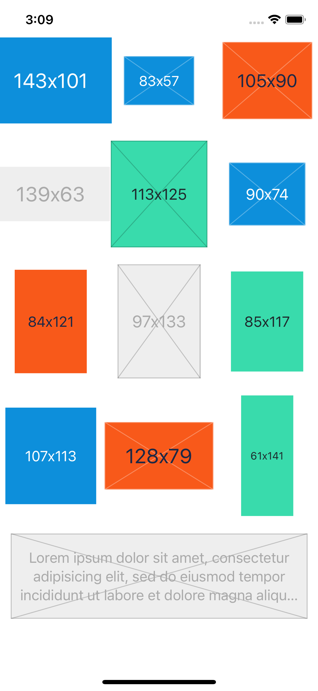
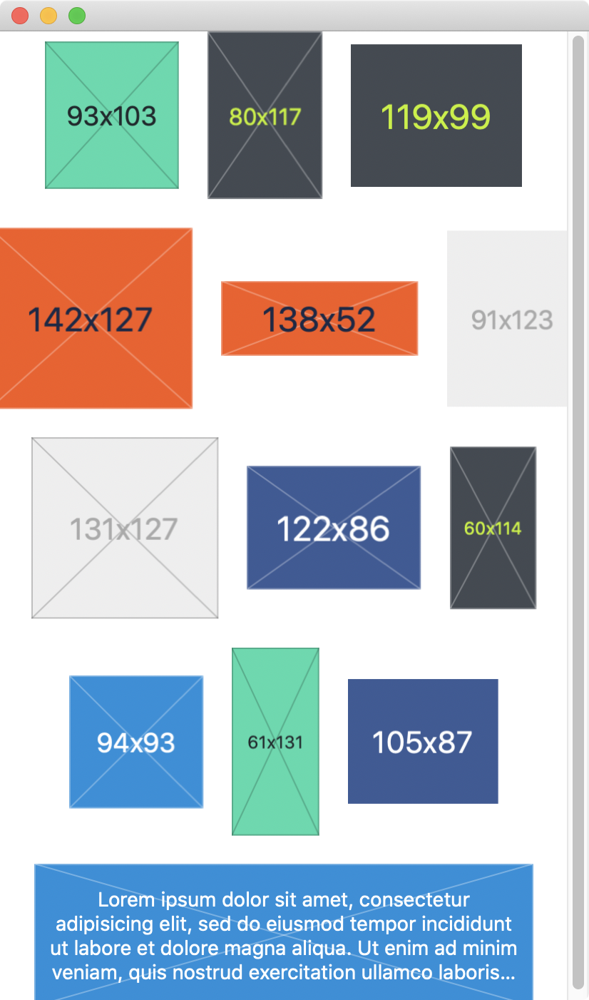

# ImagePlaceholder

Yet another `UIImage` / `NSImage` placeholder written in Swift.

## Examples

| iOS | macOS |
|---|---|
|  |  |

## How to Use

```swift
let placeholder = UIImage.placeholder(
    size: CGSize(width: 350, height: 100)
)

// or

let placeholder = NSImage.placeholder(
    size: CGSize(width: 350, height: 100),
    theme: .random(),
    padding: 10,
    alpha: 1,
    outline: true,  // Draws border and "X" mark
    alignment: .center,
    font: .systemFont(ofSize: 14),
    text: { size in "Lorem ipsum \(size.width)x\(size.height)" }
)
```

## License

[MIT](LICENSE)